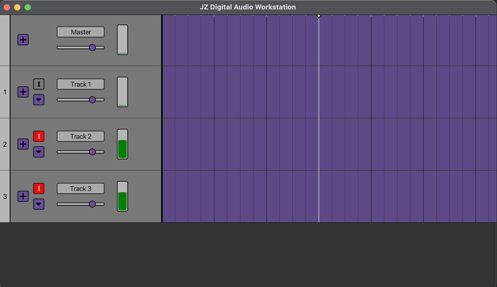

# JZ Digital Audio Workstation

JZDAW is a feature-rich digital audio workstation (DAW) designed for music production, audio recording, and sound design. It combines a sleek and intuitive Kotlin-based front-end with a robust and efficient C-based audio streaming library, providing an exceptional user experience and high-performance audio processing capabilities.

<!-- markdownlint-disable MD033 -->

<!-- markdownlint-enable MD033 -->
